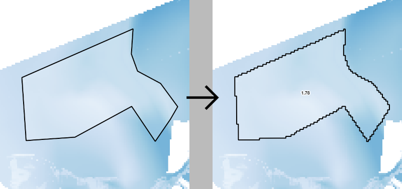

# QGis pixel calculator

A QGis plugin to interactively calculate an aggregate value of selected pixels of a raster layer. Currently it supports calculating the mean value.

## Guide

- Select a raster layer in the layer panel.
- Start a calculation using the menu Raster » PixelCalculator » Calculate pixel value
- Draw a polygon on top of the raster layer.

## Result

- Your polygon will be aligned to the raster grid. All pixels overlapping at least 50% with your polygon will be included.
- The mean value of all matching pixels will be shown as its label.

## Preview

